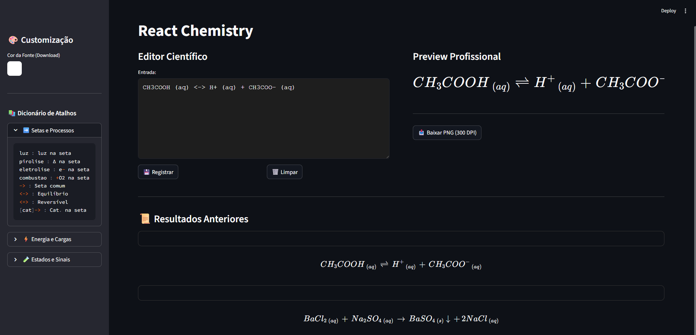

# 🧪 React Chemistry

> **Projeto Pessoal:** Uma ponte entre a Química e a Programação para facilitar a vida de quem estuda e produz conteúdo acadêmico.

O **React Chemistry** nasceu de uma dor de cabeça constante: a dificuldade de digitar reações químicas de forma rápida, organizada e esteticamente agradável. Como estudante de Química e entusiasta da Programação, decidi criar um editor que fizesse o "trabalho sujo" de formatação por mim.

A ideia não é ser um software pesado, mas um editor leve e intuitivo que converte sintaxes simples em fórmulas perfeitas em **LaTeX**, prontas para download em alta resolução.

---

## 🛠️ O que eu foquei em resolver?

* **⚡ Agilidade:** Atalhos pensados no dia a dia (como `pirolise`, `luz`, `deltaH`) para você não perder tempo caçando símbolos no teclado.
* **🎨 Estética:** O motor ajusta o espaçamento automático. Chega de reagentes e setas "colados" e difíceis de ler.
* **📥 Exportação de Elite:** Gera arquivos PNG transparentes em **300 DPI**. Isso garante que a fórmula não fique pixelada quando você esticar a imagem no PowerPoint ou Word.
* **🖥️ Interface "Low-Distraction":** Fundo neutro e design limpo. O foco é total na sua reação.

---

## 📸 Preview
*(Dica: Tire um print do app rodando e coloque o arquivo na mesma pasta do projeto no GitHub. Depois, substitua o link abaixo pelo nome da imagem)*



---

## 🚀 Como rodar na sua máquina

Para rodar o projeto localmente, você só precisa do Python instalado e seguir os passos abaixo:

1. **Instale as dependências:**
   ```bash
   pip install streamlit matplotlib

2. **Rode o arquivo:**
   ```bash
   streamlit run app.py
 